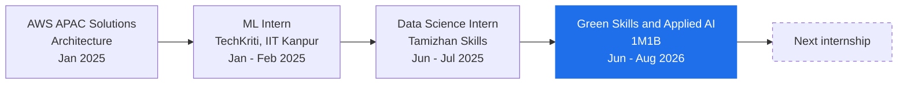
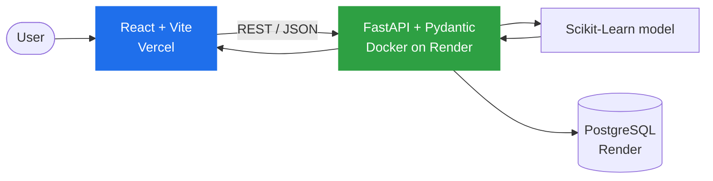
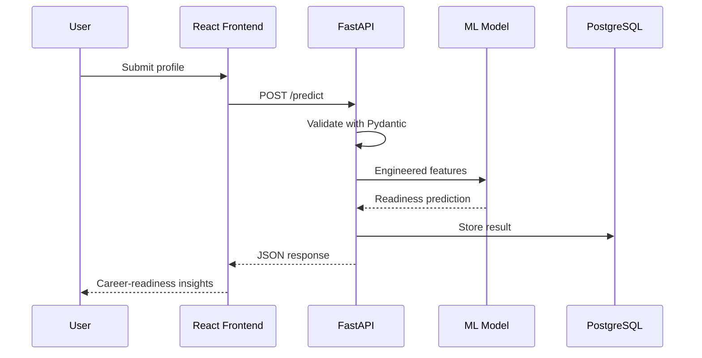
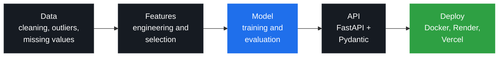
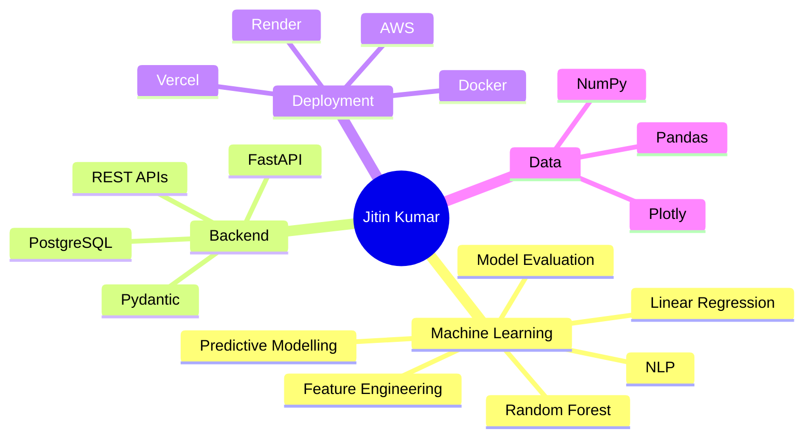

<!-- ============================== HEADER ============================== -->
<div align="center">


<a href="https://github.com/Jitin2102">

</a>

<br/>

<a href="https://github.com/Jitin2102"></a>
<a href="https://www.linkedin.com/in/jitin2102"></a>
<a href="mailto:jitinkuietkanpur@gmail.com"></a>
<a href="https://skill-green.vercel.app"></a>

<br/><br/>


<br/><br/>

**[About](#about)** &nbsp;|&nbsp; **[Impact](#impact)** &nbsp;|&nbsp; **[Experience](#experience)** &nbsp;|&nbsp; **[Projects](#projects)** &nbsp;|&nbsp; **[Skills](#skills)** &nbsp;|&nbsp; **[Stats](#stats)** &nbsp;|&nbsp; **[Contact](#contact)**

</div>

---

<a name="about"></a>

## About

> *Building intelligent systems that turn data into useful decisions.*

I'm a **B.Tech Computer Science Engineering (AI)** student at **CSJM University (UIET), Kanpur**. I build machine-learning systems end to end: **data, model, API, deployment**. My focus is **applied ML and NLP for climate action and education**, with an emphasis on systems that are **explainable, personalised and useful outside a notebook**.

<table>
<tr>
<td width="52%" valign="top">

```yaml
name:        Jitin Kumar
role:        AI/ML Developer, Backend Engineer
education:   B.Tech CSE (AI)
university:  CSJM University (UIET), Kanpur
period:      Aug 2024 - Jun 2028
cgpa:        8.71 / 10  
core_stack:  Python, FastAPI, Scikit-Learn
domains:     ML, NLP, Data Science, Applied AI
seeking:     Internships in applied AI / ML
```

</td>
<td width="48%" valign="top">

**Currently working on**

- Extending **SkillGreen** with resume parsing, model explainability and skill-gap analysis
- Strengthening ML and NLP fundamentals
- Writing cleaner, production-style ML serving code

**Ask me about**

- Serving ML models with FastAPI
- Feature engineering with Scikit-Learn
- Shipping ML apps with Docker, Render and Vercel

</td>
</tr>
</table>

---

<a name="impact"></a>

## Impact in Numbers

<div align="center">


</div>

---

<a name="experience"></a>

## Experience



<details open>
<summary><b>Green Skills &amp; Applied AI for Climate Action Intern</b> &nbsp;|&nbsp; 1M1B &nbsp;|&nbsp; <code>Jun 2026 - Aug 2026</code></summary>
<br/>

Programme run with Microsoft Elevate, MeitY Startup Hub and UP Pragya.

- Completed **70+ hours** of training in AI for climate action and green skills.
- Built and deployed **SkillGreen**, an ESG career-readiness prediction platform, using **FastAPI, Scikit-Learn and React**.
- Extending it with **resume parsing, model explainability and skill-gap analysis**.

</details>

<details>
<summary><b>Data Science &amp; Analytics Intern</b> &nbsp;|&nbsp; Tamizhan Skills &nbsp;|&nbsp; <code>Jun 2025 - Jul 2025</code></summary>
<br/>

- Worked across the complete data workflow on **5+ datasets**.
- Reduced dataset inconsistencies by about **25%** through outlier detection and missing-value handling.
- Reduced data-handling time by about **40%** with vectorised NumPy operations.
- Built **3 interactive Plotly dashboards** for data-driven analysis.

</details>

<details>
<summary><b>Machine Learning Intern</b> &nbsp;|&nbsp; TechKriti, IIT Kanpur &nbsp;|&nbsp; <code>Jan 2025 - Feb 2025</code></summary>
<br/>

- Built **2 supervised learning models**: an NLP classifier and a regression model.
- Reduced training time by about **20%** through feature selection and efficient Scikit-Learn preprocessing.
- Ranked **Top 3** in the internal showcase and presented results to an **IIT Kanpur faculty panel**.

</details>

<details>
<summary><b>AWS APAC Solutions Architecture Virtual Program</b> &nbsp;|&nbsp; Forage &nbsp;|&nbsp; <code>Jan 2025</code></summary>
<br/>

- Designed a scalable **AWS Elastic Beanstalk** hosting architecture for a simulated client requirement.
- Presented the technical recommendation clearly to a non-technical audience.

</details>

---

<a name="projects"></a>

## Featured Projects

<div align="center">

| **SkillGreen** | **RiskLens** | **ModelServe** |
|:---:|:---:|:---:|
| ESG career-readiness prediction | Insurance premium risk classifier | ML model-serving layer |
| `FastAPI` `React` `PostgreSQL` `Docker` | `Scikit-Learn` `FastAPI` | `FastAPI` `Jupyter` |
| [Repository](https://github.com/Jitin2102/SkillGreen) &nbsp;/&nbsp; [Live demo](https://skill-green.vercel.app) | [Repository](https://github.com/Jitin2102/RiskLens) | [Repository](https://github.com/Jitin2102/ModelServe) |

</div>

### SkillGreen: ESG Career-Readiness Prediction Platform

> An end-to-end ML application that predicts ESG career readiness from a user's profile and provides the foundation for personalised career insights.

<div align="center">

<a href="https://github.com/Jitin2102/SkillGreen"></a>
<a href="https://skill-green.vercel.app"></a>

</div>

**System architecture**



**Request lifecycle**



<details>
<summary><b>Build details and roadmap</b></summary>
<br/>

- ML-based ESG career-readiness prediction with feature engineering and predictive modelling
- FastAPI + Pydantic inference backend, containerised with Docker
- React + Vite frontend on Vercel; backend and PostgreSQL database on Render
- **In development:** resume parsing, model explainability, skill-gap analysis

**Stack:** `Python` `Scikit-Learn` `FastAPI` `Pydantic` `React` `Vite` `PostgreSQL` `Docker`

</details>

### RiskLens: Insurance Premium Risk Predictor

> Classifies an insurance profile into **Low, Medium or High** premium-risk categories.

<details>
<summary><b>Build details</b></summary>
<br/>

- Structured-data preprocessing with feature engineering integrated into the model pipeline
- ML-based risk classification
- FastAPI inference service exposed through a REST interface

**Stack:** `Python` `Scikit-Learn` `FastAPI` `Feature Engineering`

</details>

### ModelServe: FastAPI ML Model Serving Layer

> A lightweight serving layer that exposes trained models through structured REST APIs.

<details>
<summary><b>Build details</b></summary>
<br/>

- Preprocessing, prediction and model-evaluation endpoints
- Auto-generated API documentation
- Jupyter-based experimentation workflow

**Stack:** `Python` `FastAPI` `REST APIs` `Jupyter`

</details>

### Student Performance Analytics Dashboard

> Combines academic and behavioural signals to identify students who may need early intervention.

<details>
<summary><b>Build details</b></summary>
<br/>

- Combined **grades, attendance and login activity** into one dataset
- **Random Forest** classifier reaching **87% accuracy** in identifying low-performing students
- Dashboard-oriented data pipeline with per-student improvement suggestions

**Stack:** `Python` `Pandas` `Scikit-Learn` `Matplotlib` `Jupyter`

</details>

<!-- Add QuantumSync, MyShell and the Tamizhan projects here in the same format. -->

---

## How I Build



---

<a name="skills"></a>

## Skills

<div align="center">

**Languages and Core Tools**


**Machine Learning and AI**


**Data and Visualisation**


**Backend, Web and Deployment**


</div>



---

<a name="stats"></a>

## Stats and Activity

<div align="center">

**Contributions over the last 12 months**


<br/><br/>

<picture>
  <source media="(prefers-color-scheme: dark)" srcset="https://raw.githubusercontent.com/Jitin2102/Jitin2102/output/github-snake-dark.svg">
  <source media="(prefers-color-scheme: light)" srcset="https://raw.githubusercontent.com/Jitin2102/Jitin2102/output/github-snake.svg">
  
</picture>

<br/><br/>

<a href="https://github.com/Jitin2102?tab=repositories">

</a>
<a href="https://github.com/Jitin2102/SkillGreen">

</a>
<a href="https://github.com/Jitin2102/SkillGreen/commits">

</a>
<a href="https://github.com/Jitin2102/SkillGreen">

</a>

<br/><br/>

**400+ LeetCode problems solved**

<a href="https://leetcode.com/u/____jitin_2102____/">

</a>

</div>

---

## Certifications and Activities

| Certification / Activity | Organization |
|---|---|
| Machine Learning Certification | **TechKriti, IIT Kanpur** |
| Data Science & Analytics Certification | **Tamizhan Skills** |
| Machine Learning with Python | **freeCodeCamp** |
| Green Skills & Applied AI for Climate Action | **1M1B** |
| National Service Scheme | **NSS Volunteer** |

### Coding Profiles

<div align="center">

<a href="https://leetcode.com/u/____jitin_2102____/"></a>
<a href="https://www.hackerrank.com/profile/jk9120810343"></a>
<a href="https://www.kaggle.com/jitin2102"></a>
<a href="https://www.geeksforgeeks.org/user/____jitin_2102____/"></a>

</div>

---

<a name="contact"></a>

## Contact

<div align="center">

I'm open to **internships** and collaborations in **applied ML, NLP and AI for climate and education**.

<a href="https://drive.google.com/drive/u/0/folders/1mHHLO0e4QoOJCEMy72HYjNLsbiehyGeH"></a>
<a href="https://www.linkedin.com/in/jitin2102"></a>
<a href="mailto:jitinkuietkanpur@gmail.com"></a>
<a href="https://github.com/Jitin2102"></a>

<br/><br/>

`AI/ML` &nbsp;|&nbsp; `Backend Engineering` &nbsp;|&nbsp; `Data Science` &nbsp;|&nbsp; `Applied AI`

<i>Thanks for stopping by. 🌠⭐</i>


</div>
